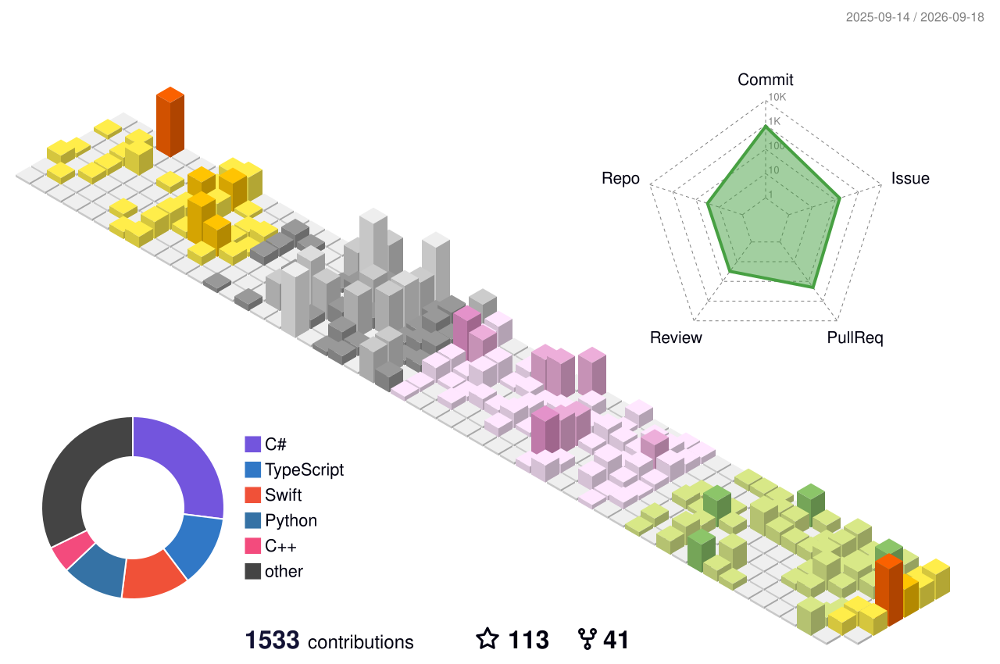

# 07JP27

Azure とAI を軸に、クラウドからハードウェアまで「面白い」と思ったものを作っています。

### Tech Stack

### GitHub Stats

<table>
  <tr>
    <td width="50%">
      <picture>
        <source media="(prefers-color-scheme: dark)" srcset="profile/stats-dark.svg" />
        <source media="(prefers-color-scheme: light)" srcset="profile/stats-light.svg" />
        
      </picture>
    </td>
    <td width="50%">
      <picture>
        <source media="(prefers-color-scheme: dark)" srcset="profile/top-langs-dark.svg" />
        <source media="(prefers-color-scheme: light)" srcset="profile/top-langs-light.svg" />
        
      </picture>
    </td>
  </tr>
</table>

### Featured Projects

<table>
  <tr>
    <td width="50%">
      <a href="https://github.com/07JP27/DurableMultiAgentTemplate">
        <picture>
          <source media="(prefers-color-scheme: dark)" srcset="profile/pin-durable-dark.svg" />
          <source media="(prefers-color-scheme: light)" srcset="profile/pin-durable-light.svg" />
          
        </picture>
      </a>
    </td>
    <td width="50%">
      <a href="https://github.com/07JP27/ZoomacIt">
        <picture>
          <source media="(prefers-color-scheme: dark)" srcset="profile/pin-zoomacit-dark.svg" />
          <source media="(prefers-color-scheme: light)" srcset="profile/pin-zoomacit-light.svg" />
          
        </picture>
      </a>
    </td>
  </tr>
  <tr>
    <td width="50%">
      <a href="https://github.com/07JP27/azureopenai-essential-notebooks">
        <picture>
          <source media="(prefers-color-scheme: dark)" srcset="profile/pin-openai-dark.svg" />
          <source media="(prefers-color-scheme: light)" srcset="profile/pin-openai-light.svg" />
          
        </picture>
      </a>
    </td>
    <td width="50%">
      <a href="https://github.com/07JP27/GitHub-Copilot-Physical-Notifier">
        <picture>
          <source media="(prefers-color-scheme: dark)" srcset="profile/pin-notifier-dark.svg" />
          <source media="(prefers-color-scheme: light)" srcset="profile/pin-notifier-light.svg" />
          
        </picture>
      </a>
    </td>
  </tr>
</table>

### Contribution Graph

<picture>
  <source media="(prefers-color-scheme: dark)" srcset="profile-3d-contrib/profile-night-rainbow.svg" />
  <source media="(prefers-color-scheme: light)" srcset="profile-3d-contrib/profile-season-animate.svg" />
  
</picture>

---

  
  
  

